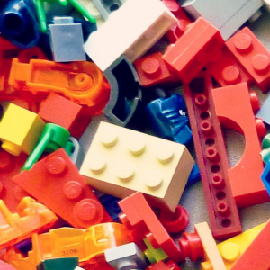
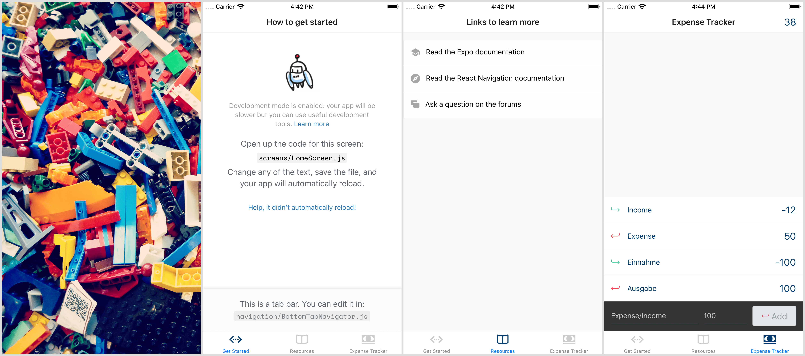
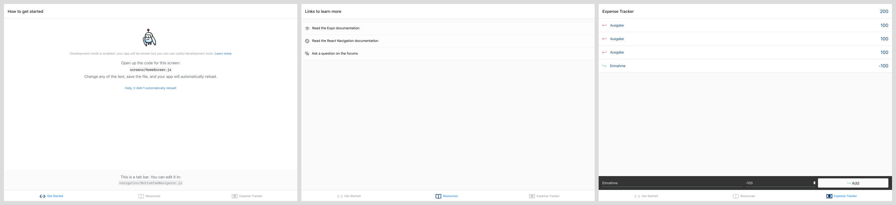

# React Native Playground App

This project will be my playground for different React Native related topics.
To try out stuff, it does not need always a new project, it can be included all in one.

## App

## Web

This app is working as web application thanks to react-native-web.

---

Built with [Expo](https://github.com/expo/expo) SDK 38.
